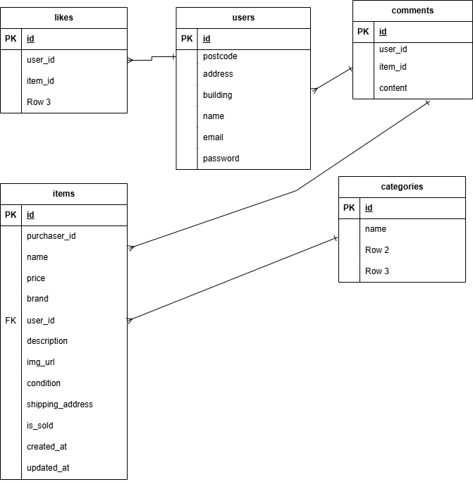

# furima
```
# GitHub から git clone する
git clone git@github.com:sugi3105/furima.git

# clone した furima フォルダに移動する
cd furima

# docker でビルドする
docker-compose up -d --build
```

## Laravel環境構築
1. `docker-compose exec php bash`
2. `composer install`
3. 'cp .env.example .env
4. 「.env.example」ファイルを 「.env」ファイルに命名を変更。または、新しく.envファイルを作成
5. .envに以下の環境変数を追加
``` text
DB_CONNECTION=mysql
DB_HOST=mysql
DB_PORT=3306
DB_DATABASE=laravel_db
DB_USERNAME=laravel_user
DB_PASSWORD=laravel_pass
```
5. アプリケーションキーの作成
・　php artisan key:generate

6. マイグレーションの実行
・　php artisan migrate

7. シーディングの実行
・  php artisan db:seed

8. ストレージリンク作成
.   php artisan storage:link

9. 実行確認  
   `http://localhost/` へアクセスして動作確認をする  
   エラーが出て表示できない場合は `sudo chmod -R 777 ./src/*` コマンドを実行する  

10. Stripe設定
　　Stripe決済機能を利用する場合は.envに以下を設定してください。
   STRIPE_KEY=取得したキー
   STRIPE＿SECRET＝取得したシークレットキー

## 使用技術
   
   `php8.3.0`
   `Laravel8.83.27`
   `MySQL8.0.26`

## ER図



　
　
## URL
  環境開発:http://localhost/
  phpMyAdmin: http://localhost:8080
